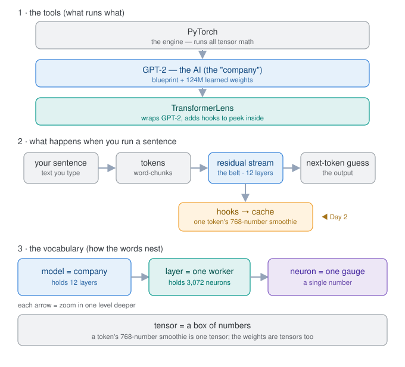

# 🔦 Prism

**Splitting a language model's tangled "thoughts" into clean, readable, steerable features — the way a prism splits white light.**

Modern language models are black boxes. They give great answers, but the knowledge inside them is smeared across millions of neurons in a tangle nobody can read directly. **Prism opens that box.** It trains a *sparse autoencoder* to un-mix a transformer's overloaded neurons into a large dictionary of single-meaning **features** — then lets you browse those features and **steer** the model by turning them up and down.

> **Status:** 🚧 Work in progress, built in the open, one small step at a time. **Phase 1 (see inside the model) is complete.** See the [full plan](PLAN.md).

---

## Why this exists

A neuron in GPT-2 isn't a tidy "ocean detector." Watch a single one across many sentences and it fires for a bizarre, unrelated grab-bag — law, cooking, code, sports, the ocean — all at once. This is **superposition**: the model packs in more concepts than it has neurons, so each neuron does several unrelated jobs. That's *why* you can't read a model by reading its neurons.

Prism's job is to fix that: re-express those blurry, overloaded neurons as a much bigger set of **clean features**, where one entry really does mean "the ocean" and another really does mean "legal language."



---

## What's here so far

Phase 1 is a hands-on tour of a transformer's internals — three small, heavily-commented scripts:

| Script | What it does |
|---|---|
| [`day01_hello_model.py`](day01_hello_model.py) | Loads GPT-2-small (on Apple Silicon / MPS) and completes a sentence. |
| [`day02_peek_inside.py`](day02_peek_inside.py) | Hooks the **residual stream** and views the raw activations — the model's blended "thought" for each token. |
| [`day03_one_neuron.py`](day03_one_neuron.py) | Inspects a single neuron across 30 diverse sentences and shows it firing on an unrelated jumble — **superposition, demonstrated.** |

---

## Roadmap

- [x] **Phase 1 — See inside the model** (tokens, residual stream, neurons, superposition)
- [ ] **Phase 2 — Collect activations** from a real text corpus (the SAE's training data)
- [ ] **Phase 3 — Build & train the sparse autoencoder** (the un-mixer)
- [ ] **Phase 4 — Interpret features** (max-activating examples + auto-labeling)
- [ ] **Phase 5 — Steering** (turn a feature up, watch the output bend)
- [ ] **Phase 6 — Dashboard** (FastAPI + React: browse features, view metrics, steer live)

Full day-by-day breakdown in [`PLAN.md`](PLAN.md).

---

## Getting started

```bash
# clone
git clone git@github.com:bcherukuri2004/prism.git
cd prism

# set up a fresh environment
python3 -m venv venv
source venv/bin/activate
pip install -r requirements.txt

# run the Phase 1 scripts
python day01_hello_model.py
python day02_peek_inside.py
python day03_one_neuron.py
```

The first run downloads GPT-2-small's weights (~500 MB) from Hugging Face and caches them.

---

## Tech stack

- **[PyTorch](https://pytorch.org/)** — the model + all tensor math (runs on Apple Silicon MPS)
- **[TransformerLens](https://github.com/TransformerLensOrg/TransformerLens)** — hooks for reading and editing a model's internals
- **GPT-2-small** — the model under the microscope (small, famous, well-studied)
- *Coming later:* FastAPI + React/Vite for the interactive dashboard

---

## Background

This project is a from-scratch build of the core ideas behind **sparse-autoencoder interpretability** — the same family of techniques behind work like Anthropic's "Golden Gate Claude." It's built to learn the concepts deeply, not just call an API.
